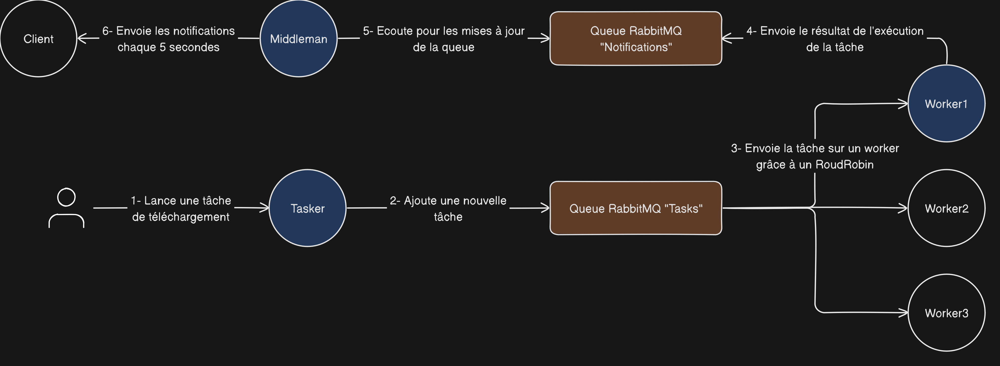

# silverdog

A simple task scheduler in Go using RabbitMQ.

## Usage

### With docker

Ensure you have docker installed:

```sh
docker-compose up
```

By default three workers named worker1, worker2 and worker3 are launched. To add more workers, modify the `compose.yaml` file by adding a new service [your_worker_name]:

```yaml
services:
  workerX:
    container_name: silverdog_workerX
    build: ./worker
    command: ["app", "-rhost", "rabbit1", "-name", "workerX"]
    networks:
      - rabbitmq_go_net
    restart: on-failure
    depends_on:
      - rabbitmq
    links:
      - rabbitmq
```

### Without docker

You have to launch each application individually.

## Architecture


